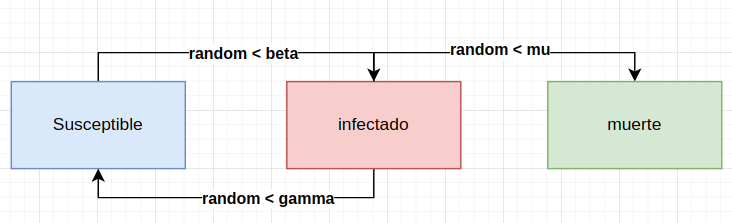
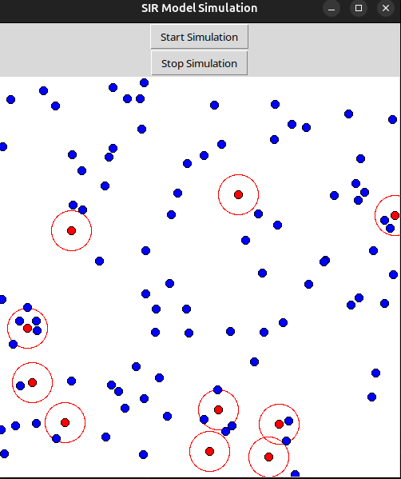

# SIR Model Simulation

Este proyecto implementa una simulación del modelo SIR (Susceptible, Infectado, Recuperado) utilizando C++ y Tcl/Tk para la visualización. La simulación muestra cómo una enfermedad infecciosa se propaga en una población y permite visualizar el estado de cada individuo en la población.

## Requisitos

- C++11 o superior
- Tcl/Tk
- CMake

## Instalación

1. **Instalar los paquetes de desarrollo de Tcl/Tk**:
   ```sh
   sudo apt-get install tcl-dev tk-dev
   ```

2. **Clonar el repositorio del proyecto**:
   ```sh
   git clone https://github.com/tu-usuario/sir-simulation.git
   cd sir-simulation
   ```

## Ejecución

1. **Construir el programa y ejecutar la simulación**:
   ```sh
   ./build.sh
   ```

   **Nota**: Por defecto, build.sh ejecuta la simulación con GUI. Si deseas ejecutar la simulación sin GUI, cambia la última línea de build.sh

      ```sh
      ./SIRSimulation --no-gui
      ```

2. **Ver los resultados de la correlación**:
   ```sh
   ./prcc.sh
   ```

## Descripción del Código

### Estructura del Proyecto

- `main.cpp`: Contiene la implementación principal de la simulación del modelo SIR.
- `CMakeLists.txt`: Archivo de configuración de CMake para construir el proyecto.
- build.sh : Script para configurar, construir el proyecto y ejecutar la simulación.
- `clean.sh`: Script para limpiar el directorio de trabajo.
- `genlhsmatrix.txt`: Archivo de configuración para generar el archivo `lhsmatrix`.
- `prcc.sh`: Script para ejecutar PRCC y ver los resultados de la correlación.

### Modelo Basa en Agentes



### Parámetros del Modelo SIR

- `beta`: Tasa de transmisión.
- `gamma_`: Tasa de recuperación.
- `mu`: Tasa de mortalidad.
- `numPeople`: Número de personas en la población.
- `infectionRadius`: Radio de infección.

### Funciones Principales

- `initializePopulation(SimulationData& data, int initialInfected)`: Inicializa la población con un número específico de personas infectadas.
- `updatePopulation(SimulationData& data, double beta, double gamma_, double mu, int& susceptibleCount, int& infectedCount, int& recoveredCount, int& deadCount)`: Actualiza el estado de la población en cada paso de tiempo.
- `updateGUI(void* clientData)`: Actualiza la GUI para reflejar el estado actual de la población.
- `startSimulation(ClientData clientData, Tcl_Interp* interp, int argc, const char* argv[])`: Inicia la simulación.
- `stopSimulation(ClientData clientData, Tcl_Interp* interp, int argc, const char* argv[])`: Detiene la simulación.
- `runSimulationWithoutGUI(SimulationData& data, int initialInfected, double** datalhs, int nvar, int nruns)`: Ejecuta la simulación sin mostrar la GUI y guarda los resultados en archivos separados.


## Resultados

### GUI



