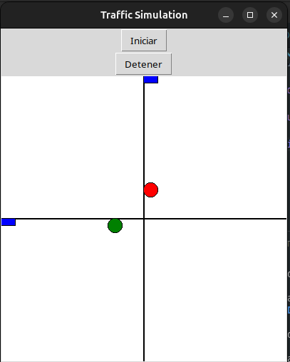

# Traffic Simulation

Este proyecto es una simulación de tráfico que utiliza C++ para la lógica de la simulación y Tcl/Tk para la interfaz gráfica de usuario (GUI). La simulación incluye semáforos y coches que se mueven en función del estado de los semáforos.

## Requisitos

- CMake 3.5 o superior
- Compilador de C++ compatible con C++11
- Tcl/Tk y sus paquetes de desarrollo

## Instalación

1. Instalar los paquetes de desarrollo de Tcl/Tk si no lo has hecho ya:

    ```sh
    sudo apt-get install tcl-dev tk-dev
    ```

2. Clonar el repositorio del proyecto:

    ```sh
    https://github.com/JoseGabriel100/computational_biology.git
    cd traffic-simulation
    ```

3. Crear un directorio de construcción y navegar a él:

    ```sh
    mkdir build
    cd build
    ```

4. Configurar el proyecto con CMake:

    ```sh
    cmake ..
    ```

5. Construir el proyecto:

    ```sh
    make
    ```

## Ejecución

Para ejecutar la simulación, simplemente ejecuta el archivo binario generado:

```sh
./TrafficSimulation
```

## Descripción del Código

### Clases y Estructuras

- **TrafficLightState**: Enum para los estados del semáforo (GREEN, YELLOW, RED).
- **TrafficLight**: Clase para representar un semáforo.
  - Atributos: `greenTime`, `yellowTime`, `redTime`, `state`, `offset`.
  - Métodos: `update(currentTime)`, `getState()`.
- **Car**: Clase para representar un coche.
  - Atributos: `lane`, `x`, `y`, `speed`.
  - Métodos: `update(trafficLightState, lightPosition)`, `getX()`, `getY()`.
- **SimulationData**: Estructura para contener los datos de la simulación.
  - Atributos: `trafficLights` (vector de TrafficLight), `cars` (vector de Car), `interp` (intérprete de Tcl).

### Funciones

- **updateSimulation**: Función para actualizar la simulación.
  - Parámetros: `data` (puntero a SimulationData).
  - Bucle mientras `simulationRunning` sea verdadero:
    - Obtener el tiempo actual y calcular el tiempo transcurrido.
    - Bloquear `mtx`.
    - Actualizar los semáforos y coches.
    - Dormir por 100 milisegundos.
- **updateGUI**: Función para actualizar la GUI.
  - Parámetros: `clientData` (puntero void).
  - Bloquear `mtx`.
  - Limpiar el canvas.
  - Dibujar las carreteras.
  - Dibujar los semáforos.
  - Dibujar los coches.
  - Programar la siguiente actualización de la GUI.
- **startSimulation**: Función para iniciar la simulación.
  - Parámetros: `clientData` (puntero void), `interp` (intérprete de Tcl), `argc` (int), `argv` (array de char).
  - Establecer `simulationRunning` a verdadero.
  - Iniciar un nuevo hilo para ejecutar `updateSimulation`.
  - Establecer el resultado de Tcl a "Simulation Running".
  - Devolver `TCL_OK`.
- **stopSimulation**: Función para detener la simulación.
  - Parámetros: `clientData` (puntero void), `interp` (intérprete de Tcl), `argc` (int), `argv` (array de char).
  - Establecer `simulationRunning` a falso.
  - Establecer el resultado de Tcl a "Simulation Stopped".
  - Devolver `TCL_OK`.
- **main**: Función principal.
  - Crear el intérprete de Tcl.
  - Inicializar Tcl y Tk.
  - Crear `SimulationData` con semáforos y coches.
  - Crear comandos Tcl para `startSimulation` y `stopSimulation`.
  - Establecer el título de la ventana y crear botones.
  - Crear canvas para dibujar.
  - Programar la primera actualización de la GUI.
  - Iniciar el bucle principal de Tk.

## Algoritmo

1. **Definir Enum TrafficLightState**
   - GREEN
   - YELLOW
   - RED

2. **Definir la Clase TrafficLight**
   - Atributos:
     - greenTime
     - yellowTime
     - redTime
     - state
     - offset
   - Métodos:
     - Constructor: Inicializar atributos
     - update(currentTime): Actualizar el estado basado en el tiempo actual
     - getState(): Devolver el estado actual

3. **Definir la Clase Car**
   - Atributos:
     - lane
     - x
     - y
     - speed
   - Métodos:
     - Constructor: Inicializar atributos
     - update(trafficLightState, lightPosition): Actualizar la posición basado en el estado del semáforo y la posición del semáforo
     - getX(): Devolver la posición x
     - getY(): Devolver la posición y

4. **Definir la Estructura SimulationData**
   - Atributos:
     - trafficLights (vector de TrafficLight)
     - cars (vector de Car)
     - interp (intérprete de Tcl)

5. **Variables Globales**
   - simulationRunning (bool atómico)
   - mtx (mutex)

6. **Definir la Función updateSimulation**
   - Parámetros: data (puntero a SimulationData)
   - Bucle mientras simulationRunning sea verdadero:
     - Obtener el tiempo actual y calcular el tiempo transcurrido
     - Bloquear mtx
     - Actualizar los semáforos y coches
     - Dormir por 100 milisegundos

7. **Definir la Función updateGUI**
   - Parámetros: clientData (puntero void)
   - Bloquear mtx
   - Limpiar el canvas
   - Dibujar las carreteras
   - Dibujar los semáforos
   - Dibujar los coches
   - Programar la siguiente actualización de la GUI

8. **Definir la Función startSimulation**
   - Parámetros: clientData (puntero void), interp (intérprete de Tcl), argc (int), argv (array de char)
   - Establecer simulationRunning a verdadero
   - Iniciar un nuevo hilo para ejecutar updateSimulation
   - Establecer el resultado de Tcl a "Simulation Running"
   - Devolver TCL_OK

9. **Definir la Función stopSimulation**
   - Parámetros: clientData (puntero void), interp (intérprete de Tcl), argc (int), argv (array de char)
   - Establecer simulationRunning a falso
   - Establecer el resultado de Tcl a "Simulation Stopped"
   - Devolver TCL_OK

10. **Definir la Función main**
    - Crear el intérprete de Tcl
    - Inicializar Tcl y Tk
    - Crear SimulationData con semáforos y coches
    - Crear comandos Tcl para startSimulation y stopSimulation
    - Establecer el título de la ventana y crear botones
    - Crear canvas para dibujar
    - Programar la primera actualización de la GUI
    - Iniciar el bucle principal de Tk

## Resultados


